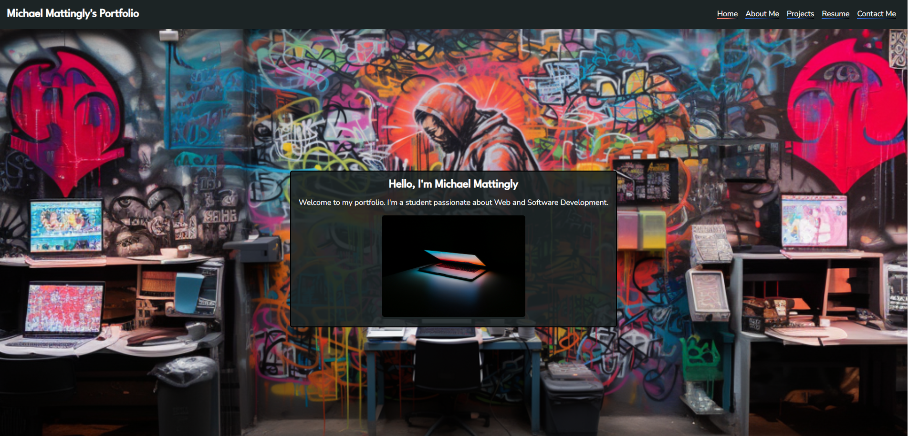
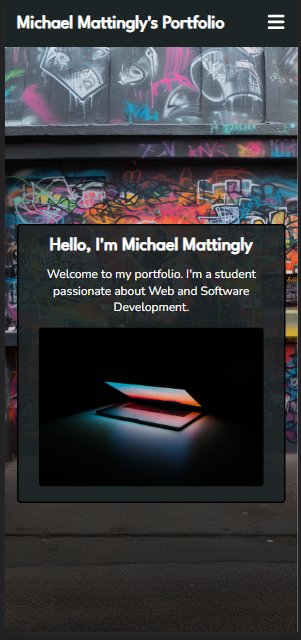

# React Web Portfolio

## Description

Link to deployed page:

This is a web-portfolio that was developed using React. This webpage uses react router to dynamically generate webpages though the virtual DOM. This application is a showcase for past and current projects that I am currently developing. Offers the various sections: A short homepage, about me, projects, a resume section that provides a link to download my current resume, and a contact me form that will automatically generate an email using EmailJs services. The footer provides links to my LinkedIn, Github, and Facebook accounts. This website is responsive to various screen sizes.

#### Full Screen Landing Page:



#### Mobile Landing Page:

[](https://github.com/MeanBean87/nosql-backend/blob/main/image/README/1692891808140.png)

## Installation

For Development:

1. Clone or fork the repository from "git@github.com:MeanBean87/react-portfolio.git"
2. Navigate to the root directory of the project using CLI.
3. Install node modules using "npm install" in either CLI or integrated terminal - vs code.
4. Start the server with "npm run start'.
5. Open with the code editor of your choice.

## Usage

1. Navigate to the deployed page here:
2. Explore the page using the nav links.

## Code Highlights

#### User of useState, useEffect and useLocation React Hooks:

```js
import "./HeaderStyles.css";

import { useEffect, useState } from "react";
import { Link, useLocation } from "react-router-dom";
import { FaBars, FaTimes } from "react-icons/fa";

const Header = () => {
  const [burgerClick, setBurgerClick] = useState(false);
  const { pathname } = useLocation();

  const burgerToggle = () => {
    setBurgerClick(!burgerClick);
  };

  useEffect(() => {
    setBurgerClick(false);
  }, [pathname]);

  return (
    <header>
      <Link to="/">
        <h1>Michael Mattingly's Portfolio</h1>
      </Link>
      <ul className={burgerClick ? "nav-menu active" : "nav-menu"}>
        <li>
          <Link
            to="/"
            className={pathname === "/" ? "current-page" : "nav-item"}
          >
            Home
          </Link>
        </li>
        <li>
          <Link
            to="/about"
            className={pathname === "/about" ? "current-page" : "nav-item"}
          >
            About Me
          </Link>
        </li>
        <li>
          <Link
            to="/projects"
            className={pathname === "/projects" ? "current-page" : "nav-item"}
          >
            Projects
          </Link>
        </li>
        <li>
          <Link
            to="/resume"
            className={pathname === "/resume" ? "current-page" : "nav-item"}
          >
            Resume
          </Link>
        </li>
        <li>
          <Link
            to="/contact"
            className={pathname === "/contact" ? "current-page" : "nav-item"}
          >
            Contact Me
          </Link>
        </li>
      </ul>
      <div className="burger" onClick={burgerToggle}>
        {burgerClick ? (
          <FaTimes size={25} style={{ color: "#FFF" }} />
        ) : (
          <FaBars size={25} style={{ color: "#FFF" }} />
        )}
      </div>
    </header>
  );
};

export default Header;

```

## Learning Points

Developing front-end application using React and React Router.

## Badges

     

## Author

Michael Mattingly

* [GitHub](https://github.com/MeanBean87)
* [LinkedIn](https://www.linkedin.com/in/michael-mattingly-5580b1280/)

Favicon owned by Michael Mattingly

This project uses the following packages:

* React  - [https://react.dev/](https://react.dev/)
* React Router - [https://reactrouter.com/en/main](https://reactrouter.com/en/main)
* React Icons - [https://www.npmjs.com/package/react-icons](https://www.npmjs.com/package/react-icons)
* EmailJs - [https://www.npmjs.com/package/emailjs](https://www.npmjs.com/package/emailjs)

## License

This project is licensed under the [MIT License](https://github.com/MeanBean87/readme-generator/blob/main/LICENSE). Please refer to the LICENSE file for more details.
